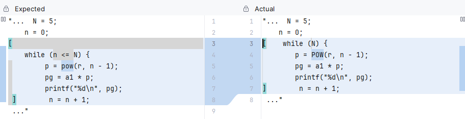

# Teste pgNormal
<b>Situação:</b> Falhou.

<b>Objetivo:</b> Testar expressões matemáticas com mais de 3 variáveis.

<b>Funcionalidades usadas:</b> POW e FOR.

## Descrição da falha

O Parser não consegue identificar uma expressão válida devido a falta da "stdlib.h". O módulo Oberon não está encontrando a função POW implementada. O While não está realizando a correta tradução da condição do código em C.

## Trecho da falha

```
pg := a1 * POW(r, n - 1);
```

<details>
<p>
<summary><b><u>Módulo Oberon</u></b></summary>
<pre>
<code>
MODULE pgNormal;

VAR
 pg, a1, r, n, N : INTEGER;

BEGIN
 a1 := 2;
 r := 3;
 N := 5;
 FOR n:= 0 TO N DO
  pg := a1 * POW(r, n - 1);
  write(pg);
  n := n + 1
END

END pgNormal.

</code>
</pre>
</details>

